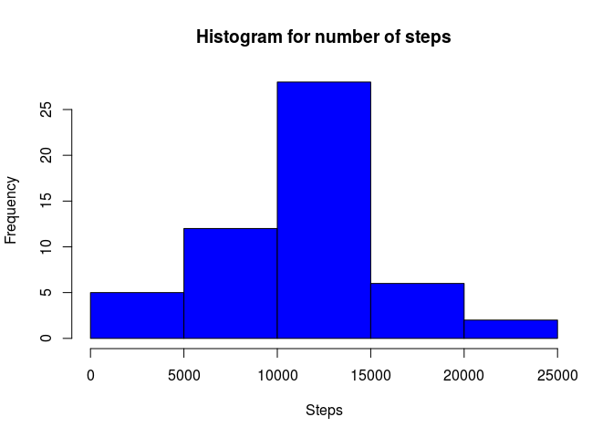
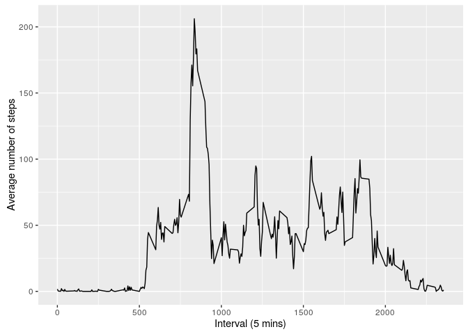
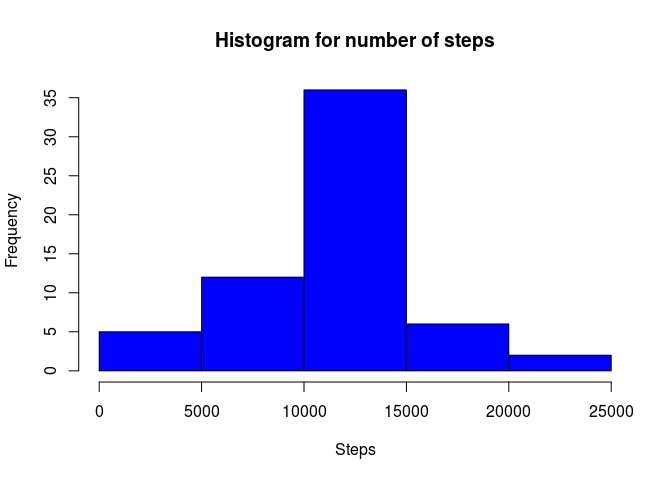
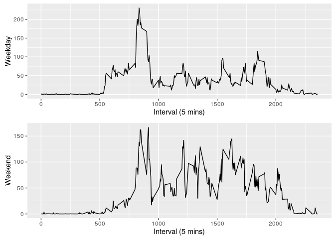

# Reproducible Research: Peer Assessment 1


## Loading and preprocessing the data

```r
library(ggplot2)
library(dplyr)
```

```
## 
## Attaching package: 'dplyr'
```

```
## The following objects are masked from 'package:stats':
## 
##     filter, lag
```

```
## The following objects are masked from 'package:base':
## 
##     intersect, setdiff, setequal, union
```

```r
library(gridExtra)
```

```
## 
## Attaching package: 'gridExtra'
```

```
## The following object is masked from 'package:dplyr':
## 
##     combine
```

```r
Sys.setlocale(locale = "en_US.utf8")
```

```
## [1] "LC_CTYPE=en_US.utf8;LC_NUMERIC=C;LC_TIME=en_US.utf8;LC_COLLATE=en_US.utf8;LC_MONETARY=en_US.utf8;LC_MESSAGES=en_US.UTF-8;LC_PAPER=nl_NL.UTF-8;LC_NAME=C;LC_ADDRESS=C;LC_TELEPHONE=C;LC_MEASUREMENT=nl_NL.UTF-8;LC_IDENTIFICATION=C"
```

```r
unzip(zipfile = "activity.zip")
observations <- read.csv("activity.csv", header = TRUE)
numberofsteps <- rowsum(observations$steps, observations$date)
```
## What is mean total number of steps taken per day?

```r
hist(numberofsteps, 
     main="Histogram for number of steps", 
     xlab="Steps", 
     col="blue")
```

<!-- -->

```r
steps_mean <- mean(numberofsteps, na.rm = TRUE)
steps_mean
```

```
## [1] 10766.19
```

```r
steps_median <- median(numberofsteps, na.rm = TRUE)
steps_median
```

```
## [1] 10765
```

## What is the average daily activity pattern?

```r
avgpi <- aggregate(x     = list(steps = observations$steps), 
                   by    = list(interval = observations$interval),
                   FUN   = mean, 
                   na.rm = TRUE)
ggplot( data  = avgpi,
        aes(x = interval, y = steps)) +
        geom_line() + 
        xlab("Interval (5 mins)") + 
        ylab("Average number of steps")
```

<!-- -->

```r
avgpi[which.max(avgpi$steps),]
```

```
##     interval    steps
## 104      835 206.1698
```


## Imputing missing values
The number of missing values in the dataset.


```r
sum(is.na(observations$steps))
```

```
## [1] 2304
```
The missing values will be replaced with the mean of that interval.


```r
tempframe <- cbind(observations,avgpi)
colnames(tempframe)[4] <- "meaninterval"
colnames(tempframe)[5] <- "meansteps"

tempframe <- tempframe %>% mutate(steps = ifelse(is.na(steps),meansteps,steps))

obscorrected <- tempframe[, c(1,2,3)]

stepscorrected <- rowsum(obscorrected$steps, obscorrected$date)
hist(stepscorrected, 
     main="Histogram for number of steps", 
     xlab="Steps", 
     col="blue")
```

<!-- -->

```r
stepscor_mean <- mean(stepscorrected, na.rm = TRUE)
stepscor_mean
```

```
## [1] 10766.19
```

```r
stepscor_median <- median(stepscorrected, na.rm = TRUE)
stepscor_median
```

```
## [1] 10766.19
```


## Are there differences in activity patterns between weekdays and weekends?


```r
obsdayadded <- obscorrected %>% mutate(day = weekdays(as.Date(date)))
obsdayadded <- obsdayadded %>% mutate(typeofday = ifelse(day=="Saturday" | day=="Sunday","weekend","weekday"))

weekdayobs <- filter(obsdayadded,typeofday=="weekday")
weekendobs <- filter(obsdayadded,typeofday=="weekend") 

avgwkdpi <- aggregate(x     = list(steps = weekdayobs$steps), 
                      by    = list(interval = weekdayobs$interval),
                      FUN   = mean, 
                      na.rm = TRUE)
p1 <- ggplot( data  = avgwkdpi,
              aes(x = interval, y = steps)) +
              geom_line() + 
              xlab("Interval (5 mins)") + 
              ylab("Weekday")

avgwknpi <- aggregate(x     = list(steps = weekendobs$steps), 
                      by    = list(interval = weekendobs$interval),
                      FUN   = mean, 
                      na.rm = TRUE)
p2 <- ggplot( data  = avgwknpi,
              aes(x = interval, y = steps)) +
              geom_line() + 
              xlab("Interval (5 mins)") + 
              ylab("Weekend")
grid.arrange(p1, p2, ncol=1)
```

<!-- -->

